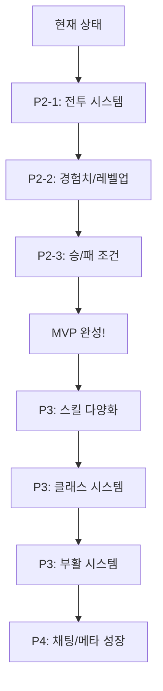

# 뱀파이어 서바이버 게임 완성 로드맵

> 📅 작성일: 2026-01-10
> 📊 기준: spec.md P1-P4 우선순위 기반

---

## 📊 현재 완료 상태

### ✅ 완료된 기능 (P1: 엔진 검증)
| 기능 | 상태 | 비고 |
|------|------|------|
| TCP/IP 접속 및 세션 관리 | ✅ | 자동 등록 로그인 |
| 방 생성/입장/퇴장 | ✅ | RoomManager 구현 |
| 500+ 몬스터 스폰 | ✅ | SpawnBatch, SpatialGrid |
| 이동 동기화 | ✅ | S_MoveObjectBatch, Delta Sync |
| 웨이브 시스템 (기본) | ✅ | WaveManager, JSON 데이터 |
| Protobuf 패킷 시스템 | ✅ | game.proto 정의 완료 |
| 비동기 DB 시스템 | ✅ | QueryAsync, RunInTransaction |

---

## 🚀 남은 작업 우선순위

### 🔴 P2: 게임 루프 핵심 (필수 - MVP)

#### 1. 전투 시스템 (Combat System)
**예상 소요: 3-5일**

| 작업 | 설명 | 패킷 |
|------|------|------|
| 플레이어 자동 공격 | 쿨타임 기반 자동 발사 | `S_SkillEffect` |
| 투사체 생성/관리 | 서버 권위적 충돌 판정 | `S_SpawnObject` (PROJECTILE) |
| 몬스터 충돌 데미지 | 플레이어-몬스터 접촉 피해 | `S_DamageEffect` |
| 몬스터 사망 처리 | HP 0 → 경험치 드랍 | `S_DespawnObject` |

```
구현 파일:
├── Server/Entity/Projectile.h (확장)
├── Server/Game/CombatManager.h (신규)
├── Server/Game/CollisionSystem.h (신규)
```

#### 2. 경험치 및 레벨업 시스템
**예상 소요: 2-3일**

| 작업 | 설명 | 패킷 |
|------|------|------|
| 경험치 젬 생성 | 몬스터 사망 시 스폰 | `S_SpawnObject` (ITEM) |
| 경험치 획득 | 플레이어 근접 시 흡수 | `S_ExpChange` |
| 젬 병합 (Merge) | 성능 최적화 | - |
| 레벨업 선택지 | 3개 옵션 제시 | `S_LevelUpOption` |
| 스킬 적용 | 선택한 스킬/패시브 적용 | `C_SelectLevelUp` |

```
구현 파일:
├── Server/Entity/ExpGem.h (신규)
├── Server/Game/ProgressionManager.h (신규)
├── Server/Data/SkillData.json (신규)
```

#### 3. 게임 승/패 조건
**예상 소요: 1일**

| 작업 | 설명 | 패킷 |
|------|------|------|
| 5분 타이머 | 생존 목표 시간 | - |
| 승리 처리 | 시간 달성 시 | `S_GameWin` |
| 패배 처리 | 전원 사망 시 | `S_GameOver` |
| 결과 저장 | 포인트/기록 DB 저장 | - |

---

### 🟠 P3: 콘텐츠 확장 (권장)

#### 4. 스킬 시스템 상세
**예상 소요: 3-4일**

| 작업 | 설명 |
|------|------|
| Active 스킬 구현 | Whip, Knife, Axe, Cross 등 |
| Passive 아이템 구현 | Spinach, Armor, Boots 등 |
| 스킬 레벨업 | 데미지/범위/쿨타임 강화 |
| 진화 시스템 | Weapon Max + Passive = Evolution |

```
데이터 파일:
├── SkillData.json
│   ├── Active: 6종 이상
│   └── Passive: 6종 이상
├── EvolutionData.json
```

#### 5. 클래스 시스템 (Co-op 특화)
**예상 소요: 2-3일**

| 클래스 | 특성 | 고유 스킬 |
|--------|------|-----------|
| Knight | 높은 HP, 넉백 저항 | Taunt (어그로 강제) |
| Mage | 높은 공격력 | Meteor (범위 폭발) |
| Priest | 아군 회복 | Sanctuary (힐링 장판) |

```
구현:
├── C_SelectClass → S_ClassChange 패킷 플로우
├── ClassData.json 로드
├── Player 생성 시 클래스 스탯 적용
```

#### 6. 사망/부활 시스템
**예상 소요: 1-2일**

| 상태 | 조건 | 처리 |
|------|------|------|
| DOWNED | HP → 0 | 묘비 표시, 행동 불가 |
| REVIVING | 동료 2m 내 대기 | 부활 게이지 차오름 |
| ALIVE | 3초 유지 | 부활 완료 |

```
패킷:
├── S_PlayerDowned
├── S_ReviveProgress (신규 필요)
├── S_PlayerRevive
```

---

### 🟡 P4: 완성도 (선택)

#### 7. 채팅 시스템
**예상 소요: 0.5일**

| 타입 | 범위 |
|------|------|
| 로비 채팅 | 대기실 전체 |
| 방 채팅 | 게임 중 팀원만 |

> 이미 프로토콜 정의됨 (`C_Chat`, `S_Chat`)

#### 8. 아웃게임 성장 (Meta-Progression)
**예상 소요: 2-3일**

| 작업 | 설명 |
|------|------|
| 성장 포인트 시스템 | 게임 종료 시 획득 |
| 스킬 트리 | 영구 능력치 강화 |
| DB 연동 | 포인트/해금 정보 저장 |

```
패킷:
├── S_SkillTreeInfo
├── C_UpgradeSkillNode
```

#### 9. 아이템 드랍 시스템
**예상 소요: 1일**

| 아이템 | 효과 |
|--------|------|
| HP 포션 | 즉시 HP 회복 |
| 보물 상자 | 랜덤 보상 |
| 자석 | 모든 젬 흡수 |

---

## 📋 구현 순서 권장안



---

## ⏱️ 예상 일정

| 마일스톤 | 예상 기간 | 핵심 산출물 |
|----------|-----------|-------------|
| **MVP (플레이 가능)** | 1-2주 | 전투, 레벨업, 승패 |
| **콘텐츠 완성** | 2-3주 | 스킬 다양화, 클래스, 부활 |
| **최종 완성** | 1주 | 채팅, 메타 성장, 폴리싱 |

**총 예상: 4-6주**

---

## 🎯 다음 단계 제안

### 즉시 시작 권장: **전투 시스템 (P2-1)**

1. `CombatManager` 클래스 설계
2. `Projectile` 생성/이동/충돌 로직
3. 플레이어 자동 공격 쿨타임 시스템
4. 몬스터 HP 감소 및 사망 처리

> 전투 시스템이 완성되면 "게임"의 핵심 루프가 작동하며, 
> 나머지 기능들은 이 기반 위에 확장됩니다.

---

## 📁 예상 신규 파일 목록

```
src/Examples/VampireSurvivor/
├── Server/
│   ├── Game/
│   │   ├── CombatManager.h/cpp      (전투 관리)
│   │   ├── CollisionSystem.h/cpp    (충돌 판정)
│   │   └── ProgressionManager.h/cpp (레벨업/스킬)
│   ├── Entity/
│   │   ├── ExpGem.h/cpp             (경험치 젬)
│   │   └── Item.h/cpp               (드랍 아이템)
│   └── Data/
│       ├── SkillData.json           (스킬 정의)
│       ├── ClassData.json           (클래스 정의)
│       └── EvolutionData.json       (진화 조합)
├── Protocol/
│   └── game.proto                   (S_ReviveProgress 추가)
```

---

## 🔧 기술적 고려사항

1. **성능**
   - 투사체 수 제한 (화면당 최대 100개?)
   - 경험치 젬 Merge로 엔티티 수 관리
   - 충돌 판정에 SpatialGrid 활용

2. **동기화**
   - 스킬 이펙트는 클라이언트 예측 가능
   - 데미지/HP는 서버 권위적

3. **확장성**
   - 스킬/몬스터 Data-Driven 설계
   - Factory 패턴으로 생성 로직 분리
